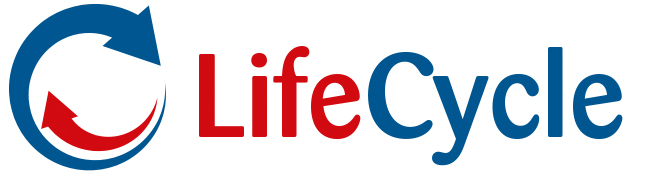

# shiny_analysis_app

This shiny app will enable LifeCycle scientists to:

* log in to different study servers
* conduct statistical analysis on the selected studies

  

This shiny app will eventually be packed into a container and placed on the central analysis server of LifeCycle, so every LifeCycle collaborator can access it via the web.

